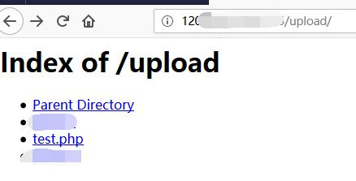

# Pass-08 Extension ::$DATA Bypass

## 0x00 Lab Overview 

This lab is maily about to bypass file extension check by using ::$DATA.

## 0x01 Source Code

```php
$is_upload = false;
$msg = null;
if (isset($_POST['submit'])) {
    if (file_exists($UPLOAD_ADDR)) {
        $deny_ext = array(".php",".php5",".php4",".php3",".php2",".html",".htm",".phtml",".pHp",".pHp5",".pHp4",".pHp3",".pHp2",".Html",".Htm",".pHtml",".jsp",".jspa",".jspx",".jsw",".jsv",".jspf",".jtml",".jSp",".jSpx",".jSpa",".jSw",".jSv",".jSpf",".jHtml",".asp",".aspx",".asa",".asax",".ascx",".ashx",".asmx",".cer",".aSp",".aSpx",".aSa",".aSax",".aScx",".aShx",".aSmx",".cEr",".sWf",".swf",".htaccess");
        $file_name = trim($_FILES['upload_file']['name']);
        $file_name = deldot($file_name);//删除文件名末尾的点
        $file_ext = strrchr($file_name, '.');
        $file_ext = strtolower($file_ext); //转换为小写
        $file_ext = trim($file_ext); //首尾去空
        
        if (!in_array($file_ext, $deny_ext)) {
            if (move_uploaded_file($_FILES['upload_file']['tmp_name'], $UPLOAD_ADDR . '/' . $_FILES['upload_file']['name'])) {
                $img_path = $UPLOAD_ADDR . '/' . $file_name;
                $is_upload = true;
            }
        } else {
            $msg = '此文件不允许上传';
        }
    } else {
        $msg = $UPLOAD_ADDR . '文件夹不存在,请手工创建！';
    }
}
```

## 0x02 Go Hack It

### Prepare a Webshell

Follow the instruction [here](../../image_webshell).


### Catch the Package

And add ::$DATA at the end od file name.


Successfully uploaded and can check here to see result.



